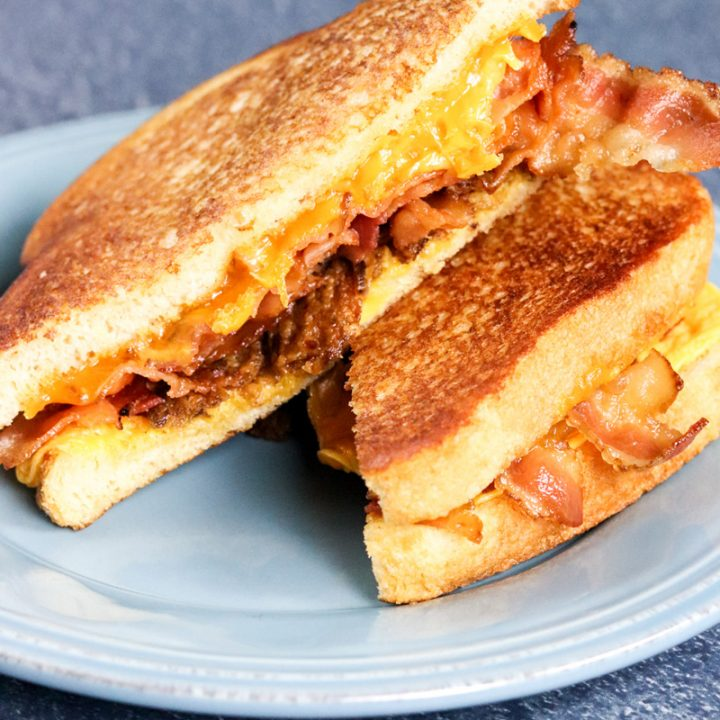

# project-4
remake recipe
# About

When i get home for school, i'll make this as a quick snack

  * prep: 1 min
  * cook: 5 min
  * servings: 1 serving
  * cost:$10
  
# ingredients
* [loaf of bread](https://www.walmart.com/ip/Great-Value-White-Bread-20-oz/10315752)-$0.84
* [cheese](https://www.walmart.com/ip/Kraft-Singles-American-Slices-16-ct-12-0-oz-Wrapper/11964619)-$2.98
* [bacon](https://www.walmart.com/ip/Oscar-Mayer-Naturally-Hardwood-Smoked-Maple-Bacon-16-oz-Vacuum-Pack/16777272)-$5.00

# Directions
1. First put cook the bacon to the desired texture 
2. Then, grab your bread and cheese 
3. Put the bread on the pan for a minute or so 
4. Then put 1 slice of cheese on 1 bread
5. Then put the bacon on top that cheese
6. Then put another slice of cheese on top the bacon 
7.and lastly the other slice of bread on the top
8. Then heat up until cheese has melted and bread is crispy
# notes
you can choose any type of bacon, cheese or even add eggs. be creative!
